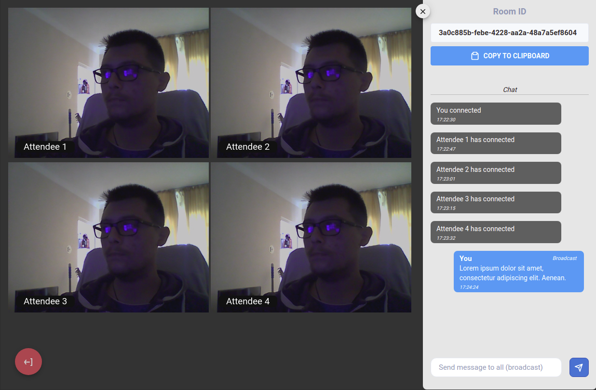
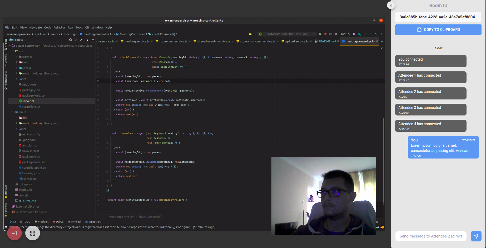

# E-xam Supervisor

Web application used for supervising online-conducted exams. Based on _WebRTC_ peer-to-peer browser API.

Created using _Angular 11_ & [_Peerjs_](https://github.com/peers/peerjs) (client app) and _Node.js_ & [_Peerjs-server_](https://github.com/peers/peerjs-server) (backend). 

### [Live Demo](https://e-xam-supervisor.web.app)

### Supervisor app

The supervisor can monitor all exam attendees' activity via the _grid view_. Using the chat when the app is in _grid mode_ will result in a **broadcast chat message**.

*Grid View*
 
 

By clicking on one of the attendees' thumbnails, the app switches to _focused mode_. Using the chat in this mode will result in a **direct chat message**.

*Focused View*
